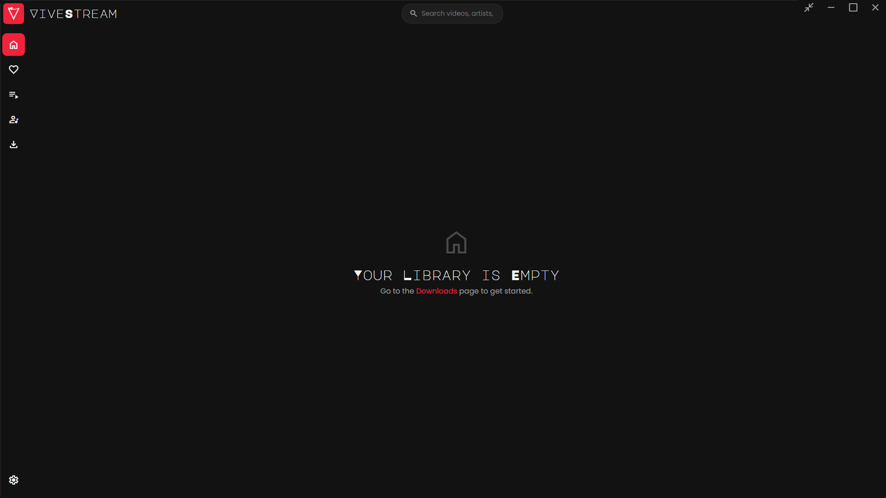

<div align="center">
  
  <h2>Your personal, offline, and stylish media sanctuary.</h2>
  <p>
    
    
    
  </p>
</div>

Welcome! **ViveStream** is a modern, offline-first media player built for those who want to curate their own collection of videos and music. It downloads content using `yt-dlp`, organizes it into a robust local database, and provides a polished, high-performance interface for you to enjoy your media without ads, buffering, or an internet connection.

# The smooth, modern graphical user interface



---

## 🚀 Core Features

- 📥 **Versatile Downloader:**
  - **YouTube & More:** Download videos and entire playlists from YouTube and other supported sites. ViveStream automatically creates local playlists for you.
  - **Smart Downloads:** Already have a video? ViveStream skips re-downloading it but updates its "date added" so it appears with the rest of its playlist.
  - **Import Local Files:** Add your existing media files from your computer directly into the ViveStream library. Thumbnails are automatically generated for local videos.
- ✂️ **Advanced Download Controls:**
  - Clip specific sections using start/end times.
  - Automatically split videos by their chapters into individual files.
  - Remove sponsored segments, intros, and outros with SponsorBlock integration.
  - Download subtitles for videos (official and auto-generated).
  - Use cookies from your browser to access members-only or age-restricted content.
- 📚 **Robust Library Management:**
  - **Powerful Search:** Instantly find what you're for with fuzzy search across videos, artists, and playlists. Results are neatly organized by category.
  - **Advanced Filtering:** Filter your library and favorites by media type (video/audio), duration, and source (YouTube/local).
  - **Full Metadata Control:** Edit titles, artists, and descriptions with a seamless inline editor directly on the player page.
  - **Playlists:** Create custom playlists, add media with a drag-and-drop interface, and upload custom cover images.
  - **Artists:** Media is automatically sorted by artist. Upload custom profile images for your favorite creators.
  - **Favorites:** A dedicated, filterable section for your most-loved content.
- 🎬 **High-Performance Integrated Player:**
  - **Context-Aware Queue:** When you play from a playlist, artist page, or favorites, the "Up Next" queue is intelligently populated and visually grouped.
  - **Gapless Playback:** Intelligent preloading ensures seamless, uninterrupted playback.
  - **Sleep Timer:** Set a timer to stop playback after a certain number of tracks, a set duration in minutes, or at a specific time of day.
  - **System Media Keys:** Control playback with your keyboard's media keys, even when the app is in the background.
  - **Full Feature Set:** Includes theater mode, fullscreen, miniplayer, playback speed control, and subtitle support.
- ⚙️ **Maintenance & Customization:**
  - **Smart Installer & Uninstaller:** A professional setup experience with options to run on startup, launch after install, and a smart uninstaller that gives you full control over your data during uninstallation.
  - **Visual Progress for File Operations:** Monitor the progress of large file imports and library exports with a real-time progress bar in the settings page.
  - **Export Library:** Save a copy of any media file or your entire library to another location, with files named by their proper titles.
  - **Reinitialize App:** A one-click function to clear the app's cache, rescan media files, and clean up any orphaned entries from the database.
- 📦 **All-in-One & Standalone:** No need to install Python, yt-dlp, or FFmpeg separately. Everything is bundled and ready to go.

---

## 📥 Installation

### Recommended Method (Installer)

1. Go to the [**Releases**](https://github.com/Md-Siam-Mia-Man/ViveStream-Revived/releases) page.
2. Download the latest `ViveStream-Installer-vX.X.X.exe` file.
3. Run the installer. It will handle everything for you.

#### Installer Features

- **✅ Clean Upgrades:** Automatically handles the removal of old versions when you install a new one.
- **🚀 Quick Launch:** Option to run ViveStream as soon as the installation finishes.
- **⚙️ Startup Control:** Choose whether to start the app automatically on system login.
- **🛡️ Safe Uninstall:** The uninstaller prompts to confirm before deleting your personal media library and settings, so you never lose data by accident.

### For Developers

1. **Clone the repository:**

    ```bash
    git clone https://github.com/Md-Siam-Mia-Man/ViveStream-Revived.git
    cd ViveStream-Revived
    ```

2. **Install dependencies:**

    ```bash
    npm install
    ```

3. **Run the application in development mode:**

    ```bash
    npm start
    ```

---

## 🎮 How to Use

1. **Download or Import Content**
    - Navigate to the **Downloads** page to fetch content from a URL.
    - Go to **Settings > Maintenance** and click **Import Files** to add local media from your computer.

2. **Manage Your Library**
    - The **Home** and **Favorites** pages display your media. Use the filter and sort buttons to refine your view.
    - The **Playlists** and **Artists** pages provide curated views. Click on a playlist or artist to see their content, where you can also upload custom cover images.
    - Use the global search bar at the top to find anything in your library.

3. **Enjoy Your Media**
    - Click any thumbnail to begin playback.
    - The "Up Next" queue will automatically show other videos from the context you started playback from (e.g., the rest of the playlist).

---

## ⌨️ Keyboard Shortcuts (Player)

| Key            | Action                 |
| -------------- | ---------------------- |
| `Space` or `K` | Play / Pause           |
| `M`            | Mute / Unmute          |
| `F`            | Toggle Fullscreen      |
| `T`            | Toggle Theater Mode    |
| `I`            | Toggle Miniplayer      |
| `←` / `→`      | Seek Back / Forward 5s |
| `↑` / `↓`      | Volume Up / Down       |
| `N`            | Play Next Media        |
| `P`            | Play Previous Media    |

---

## 🛠️ Build From Source

If you've made changes and want to create your own installer:

```bash
# This command will package the app and generate a setup executable
npm run build
```

The final installer will be located in the `release/` directory.

---

## 🤝 Contributing

Contributions are welcome! If you have an idea for a new feature or have found a bug, please feel free to fork the repository, make your changes, and open a Pull Request.

1. Fork the repo.
2. Create your feature branch (`git checkout -b feature/MyAwesomeFeature`).
3. Commit your changes (`git commit -m 'feat: Add MyAwesomeFeature'`).
4. Push to the branch (`git push origin feature/MyAwesomeFeature`).
5. Open a Pull Request.

---

## 📄 License

This project is licensed under the MIT License. See the [LICENSE](LICENSE.md) file for details.
