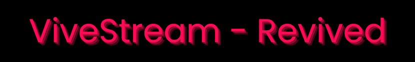

<div align="center">
  
  <h1>ViveStream - Revived</h1>
  <h2><strong>Tired of YouTube buffering? 😵‍💫 Snag your favorite videos and watch them offline in style!</strong></h2>
  <p>
    
    
    
  </p>
</div>

Welcome, media hoarders and vibe connoisseurs! 🥳 **ViveStream** is your new best friend for building your own personal, offline YouTube™️ vortex. Download anything, manage it beautifully, and play it back without ever touching the internet again.

<div align="center">

<em>Behold! The command center of your new media empire. ✨</em>
</div>

---

## 🚀 Features That Rock

- 📥 **Snag Anything!** Paste a URL (video, playlist, you name it!) and download it as a video (`.mp4`) or just the audio (`.mp3`). Easy peasy.
- 👑 **Choose Your Quality:** Go from standard 480p to glorious, pixel-perfect HD. You're the boss!
- 🎬 **Built-in Player:** Why open another app? Watch everything right here in our slick, integrated player.
- 🎛️ **Pro-Level Controls:**
  - 🎭 **Theater & Fullscreen:** For that cinematic feel.
  - 🔳 **Picture-in-Picture:** Multitask like a champ.
  - ⏩ **Speed Control:** Slow-mo analysis or chipmunk-speed recaps.
  - 💬 **Subtitles:** We'll even grab English subs for you automatically.
  - 😴 **Sleep Timer:** Binge-watch responsibly... or try to.
  - 🔁 **Autoplay:** Keep the good times rolling, non-stop.
- 📚 **Your Personal Library:** All your downloads live in a beautiful, searchable grid of awesome.
- 📦 **All-in-One-Box:** No need to install Python, yt-dlp, or FFmpeg. We packed everything you need. It just works!™️
- ⌨️ **Ninja-Fast Hotkeys:** Control the player without ever touching your mouse. (See the list below!)

---

## 📥 Installation (Let's Get This Party Started! 🎈)

### For Everyone (The Easy-Peasy, No-Sweat Method) 🚀

1️⃣ Go to the [**Releases**](https://github.com/Md-Siam-Mia-Code/ViveStream-Revived/releases) page.
2️⃣ Download the latest `ViveStream-Setup-vX.X.X.exe` file.
3️⃣ Run it, click "next" a few times, and voilà! You're in.

### For Code Wizards & Tinkerers 🧙‍♂️

1️⃣ **Clone this thing:**
```bash
    git clone https://github.com/Md-Siam-Mia-Code/ViveStream-Revived.git
    cd ViveStream
```
2️⃣ **Install the magic spells (dependencies):**
```bash
    npm install
```
3️⃣ **Fire it up!**
```bash
    npm start
```

---

## 🎮 How to Use

1.  **Feed the Beast 🐲**

    - Point it to the **Downloads** page on the sidebar.
    - Slap a YouTube URL in the box.
    - Pick your poison: quality and type (Video/Audio).
    - Hit `Download` and watch the progress bar go _brrrr_.

2.  **Enjoy the Spoils 🍿**
    - Head to the **Home** page and gaze upon your collection.
    - Use the search bar if your library gets too epic.
    - Click any video to start the show!

---

## ⌨️ Become a Keyboard Ninja

| Key            | Action                    |
| -------------- | ------------------------- |
| `Space` or `K` | Play / Pause              |
| `M`            | Mute / Unmute             |
| `F`            | Toggle Fullscreen         |
| `T`            | Toggle Theater Mode       |
| `I`            | Toggle Picture-in-Picture |
| `←` / `→`      | Skip Back / Forward 5s    |
| `↑` / `↓`      | Volume Up / Down          |
| `N`            | Play Next Video           |
| `P`            | Play Previous Video       |

---

## 🛠️ Build Your Own Version

Made some epic changes? Time to wrap it up and put a bow on it! 🎁

```bash
# This packages the app and creates your very own installer!
npm run build
```

---

## 🤝 Let's Vibe Together (Contributing)

Love ViveStream? Want to make it even more awesome? Let's do it! 💪

1.  Fork the repo.
2.  Create your feature branch (`git checkout -b feature/MyCoolNewVibe`).
3.  Commit your changes (`git commit -m 'feat: Add a new, even cooler vibe'`).
4.  Push to the branch (`git push origin feature/MyCoolNewVibe`).
5.  Open a Pull Request and let the good times roll!

---

## 📄 License

It's the MIT License. Go nuts. (Just be nice and include the original license.)
