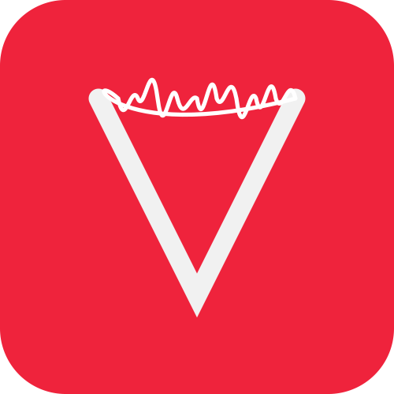

<div align="center">
  
  
  
  <h2><strong>Your personal, offline, and stylish media sanctuary.</strong></h2>
  <p>
    
    
    
  </p>
</div>

Welcome! **ViveStream** is a modern, offline-first media player and downloader built for those who want to curate their own collection of videos and music. It downloads content using `yt-dlp`, organizes it into a robust local database, and provides a polished, high-performance interface for you to enjoy your media without ads, buffering, or an internet connection.

<div align="center">

<em>The command center for your personal media library. ✨</em>
</div>

---

## 🚀 Core Features

- 📥 **Versatile Downloader:** Download videos or audio-only from YouTube and other supported sites. Choose from a wide range of quality and format options, from 480p up to 4K.
- ✂️ **Advanced Download Controls:**
  - Clip specific sections using start/end times.
  - Automatically split videos by their chapters into individual files.
  - Remove sponsored segments, intros, and outros using SponsorBlock integration.
  - Use cookies from your browser to access members-only or age-restricted content.
- 📚 **Robust Library Management:**
  - **Playlists:** Create custom playlists, add media, and reorder with intuitive drag-and-drop.
  - **Artists:** Media is automatically sorted by artist, creating dedicated pages for your favorite creators.
  - **Favorites:** A dedicated section for your most-loved content.
  - **Fast Search:** Instantly search your entire library of videos, playlists, and artists.
- 🎬 **High-Performance Integrated Player:**
  - **Gapless Playback:** Intelligent preloading ensures seamless, uninterrupted playback within playlists.
  - **Hardware Acceleration:** Smooth, efficient playback of high-resolution content with minimal CPU usage.
  - **System Media Keys:** Control playback with your keyboard's media keys, even when the app is in the background.
  - **Full Feature Set:** Includes theater mode, fullscreen, miniplayer, playback speed control, sleep timer, and subtitle support.
- 📦 **All-in-One & Standalone:** No need to install Python, yt-dlp, or FFmpeg separately. Everything is bundled and ready to go.

---

## 📥 Installation

### Recommended Method (Installer)

1.  Go to the [**Releases**](https://github.com/Md-Siam-Mia-Code/ViveStream-Revived/releases) page.
2.  Download the latest `ViveStream-Installer-vX.X.X.exe` file.
3.  Run the installer. It will handle everything for you.

### For Developers

1.  **Clone the repository:**
    ```bash
    git clone https://github.com/Md-Siam-Mia-Code/ViveStream-Revived.git
    cd ViveStream-Revived
    ```

2.  **Install dependencies:**
    ```bash
    npm install
    ```

3.  **Run the application in development mode:**
    ```bash
    npm start
    ```

---

## 🎮 How to Use

1.  **Download Content**
    -   Navigate to the **Downloads** page via the sidebar.
    -   Paste a video or playlist URL into the input box.
    -   Select your desired format (Video/Audio) and quality.
    -   Use the "Advanced Options" for clipping or chapter splitting.
    -   Click `Download` and monitor progress in the queue below.

2.  **Enjoy Your Library**
    -   The **Home** page displays all your downloaded media, sorted by most recent.
    -   The **Playlists** and **Artists** pages provide curated views of your library.
    -   Mark videos as ❤️ **Favorites** to find them in their own dedicated section.
    -   Click any thumbnail to begin playback.

---

## ⌨️ Keyboard Shortcuts (Player)

| Key            | Action                    |
| -------------- | ------------------------- |
| `Space` or `K` | Play / Pause              |
| `M`            | Mute / Unmute             |
| `F`            | Toggle Fullscreen         |
| `T`            | Toggle Theater Mode       |
| `I`            | Toggle Miniplayer         |
| `←` / `→`      | Seek Back / Forward 5s    |
| `↑` / `↓`      | Volume Up / Down          |
| `N`            | Play Next Media           |
| `P`            | Play Previous Media       |

---

## 🛠️ Build From Source

If you've made changes and want to create your own installer:

```bash
# This command will package the app and generate a setup executable
npm run build
```
The final installer will be located in the `release/` directory.

---

## 🤝 Contributing

Contributions are welcome! If you have an idea for a new feature or have found a bug, please feel free to fork the repository, make your changes, and open a Pull Request.

1.  Fork the repo.
2.  Create your feature branch (`git checkout -b feature/MyAwesomeFeature`).
3.  Commit your changes (`git commit -m 'feat: Add MyAwesomeFeature'`).
4.  Push to the branch (`git push origin feature/MyAwesomeFeature`).
5.  Open a Pull Request.

---

## 📄 License

This project is licensed under the MIT License. See the [LICENSE.md](LICENSE.md) file for details.